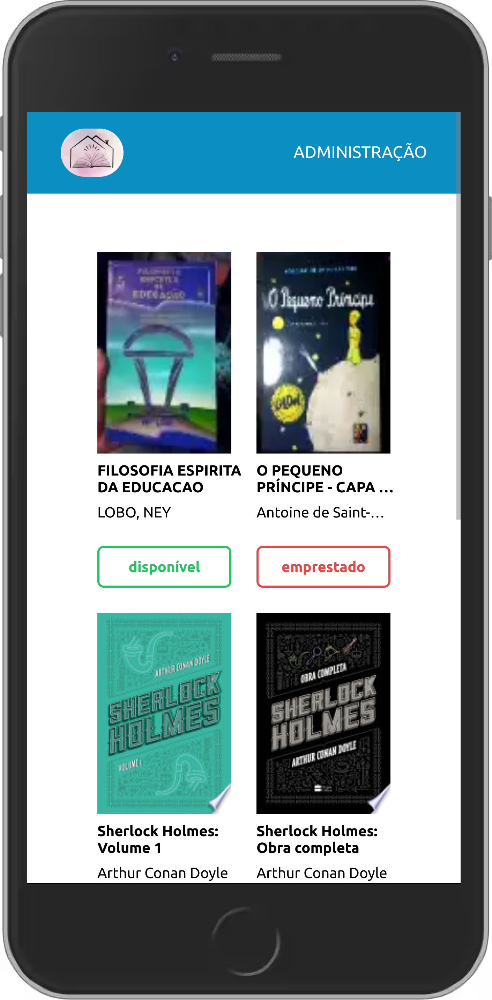
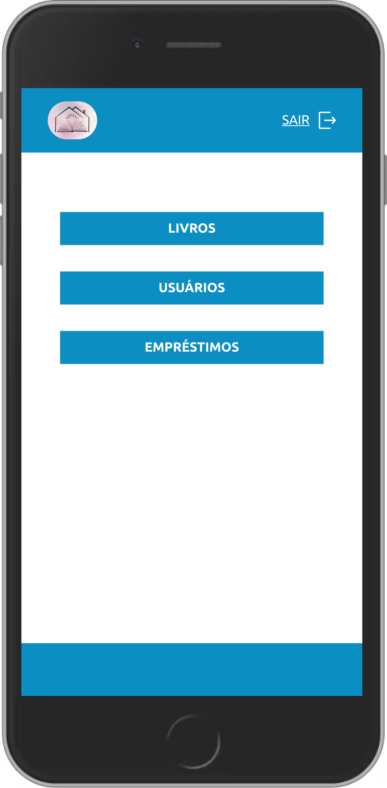
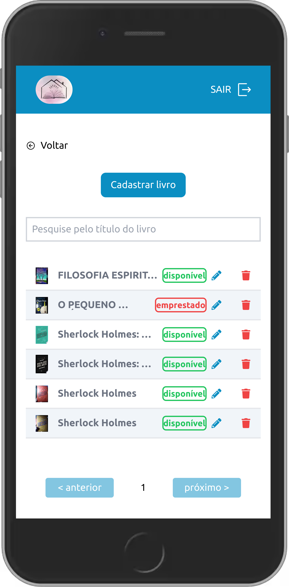
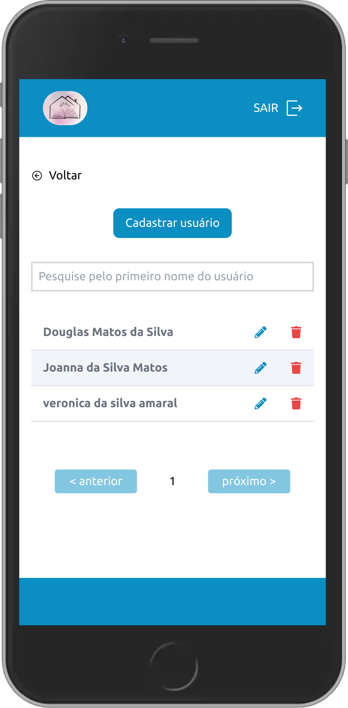
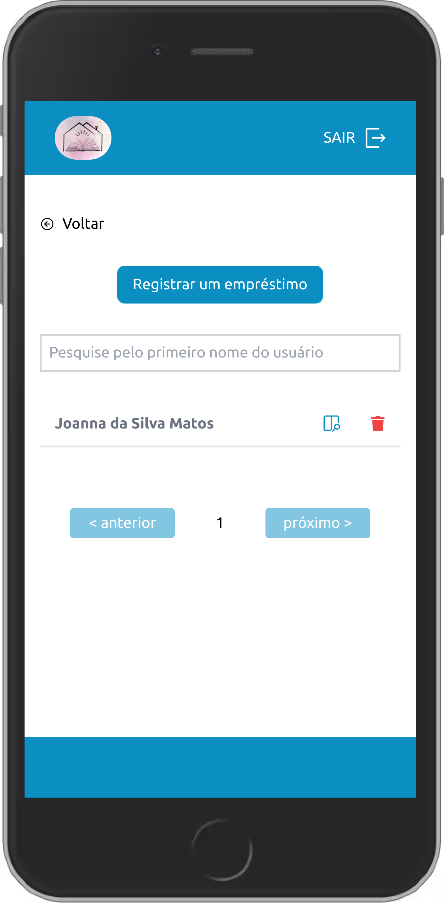
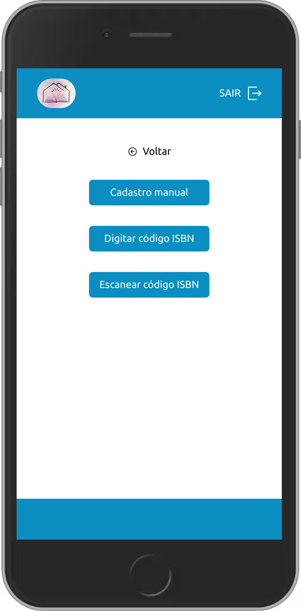
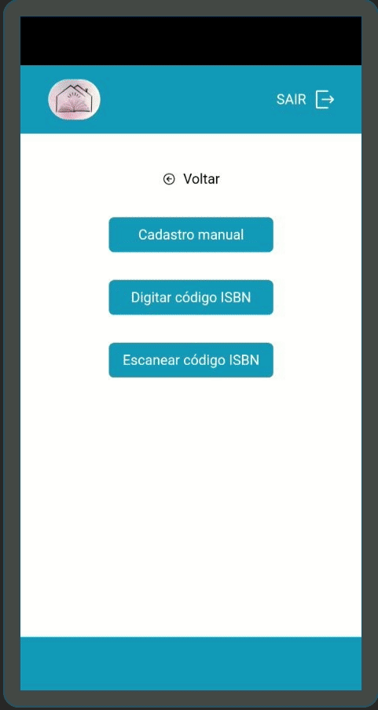

# Librosistemo


## Overview

> 🇺🇸 Documentation in English
>
> 📚 Librosistemo is a simple application for registering and managing books, users and book loans.

🇧🇷 [Documentation in Portuguese](./docs/README_PT_BR.md)

🇧🇷 [Manual in Portuguese](./docs/MANUAL_PT_BR.md)

### 🏗️ Technical documentation

- [Architecture (C4 model)](./docs/architecture/c4/README.md) · [ADRs](./docs/adr/README.md) · [Specs (SDD)](./docs/specs/README.md)
- [Current state](./docs/CURRENT_STATE.md) · [Improvement plan](./docs/IMPROVEMENT_PLAN.md)
- AI coding agents: instructions in [`AGENTS.md`](./AGENTS.md) (Claude Code, Codex CLI, Copilot CLI); specialist agents in [`.claude/agents/`](./.claude/agents/)


This application uses Google sheets as a database.

📡 APIs used to search the books
- Google API: https://www.googleapis.com
- Brazil API: https://brasilapi.com.br

## ✨ Features
- 📚 Register books manually by filling out a form, the cover can be photographed using the feature available in one of the form fields.

- 📚 Registration of books by searching by ISBN code, after the search returns an expected result, you can register the found book.

- 📚 Book registration by scanning the ISBN code, after the search returns an expected result, you can register the found book.

- 🙅 User registration

- 🎁 Loan registration


## Requirements

<a href="./docs/sheets_template.xlsx" download>
    Sheet template
</a>

1. Create a spreadsheet with the same structure as
2. Share the spreadsheet with a public link
3. Create an account Google Console
4. Create a Project and add Google Spreadshet API
5. Create all credentials (private key, email account)
6. Fill the env variable
```.env
NEXT_PUBLIC_GOOGLE_SERVICE_ACCOUNT_EMAIL='your account email here'
NEXT_PUBLIC_GOOGLE_PRIVATE_KEY='your private key here'
NEXT_PUBLIC_GOOGLE_SHEET_ID='your sheet id here'
```

## 🚀 Running development mode
```bash
yarn dev
```
🚀 The application will be running at http://localhost:3000

## 👷 Build
```bash
yarn build
```

## 👌 Running lint
```bash
yarn lint
```

> Below are some screenshots on a mobile device.

<table>
    <thead></thead>
    <tbody>
        <tr>
            <td>
                
            </td>
            <td>
                
            </td>
        </tr>
        <tr>
            <td>
                
            </td>
            <td>
                
            </td>
        </tr>
        <tr>
            <td>
                
            </td>
            <td>
                
            </td>
            </tr>
        </td>
        <td>
             <td>
                
            </td>
        </tr>
    </tbody>
</table>
