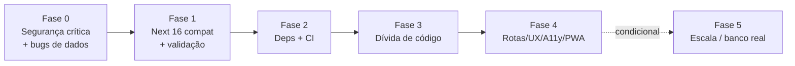

# Plano de Melhoria, Migração e Upgrade — Librosistemo

> Roadmap priorizado, derivado de [`CURRENT_STATE.md`](./CURRENT_STATE.md) (IDs S# = segurança, B# = bug referenciam as tabelas de lá).
> Regras: cada fase entra por uma spec em [`specs/`](./specs/README.md); cada task deixa `yarn test:build` verde; decisões novas geram ADR. Marque itens concluídos com data + commit/PR.
> Agentes responsáveis por área em `.claude/agents/`.

## Fase 0 — Estancar o sangramento (segurança crítica + bugs de corrupção de dados)

**Spec**: [001-hardening-seguranca](./specs/001-hardening-seguranca/spec.md) (aprovada) + hotfixes de bug.
**Agentes**: `security-specialist`, `data-layer-specialist`. **Esforço estimado: 2–4 dias.**

- [x] **S1** Validar entidade contra allowlist (`?entity=admins`/inválida → 400). *(2026-08-16, commit dfe3395 — rota nova `/api/entities`)*
- [x] **S2** Sessão real: cookie httpOnly assinado (HMAC-SHA256) com expiração; proxy valida assinatura; logout via `DELETE /api/auth`. *(2026-08-16, dfe3395)*
- [x] **S3** Env vars sem `NEXT_PUBLIC_` — credenciais Google saíram do runtime (só devDeps do script de importação). *(2026-08-16, dfe3395)*
- [x] **S4** Hash bcrypt, HTTP 401 real, `type="password"`, logs de auth removidos. *(2026-08-16, dfe3395)*
- [x] **B9** Resolvido pela migração para SQLite/Prisma: sem variável de módulo, `await` nas escritas, status corretos. *(2026-08-16, dfe3395 — spec 002/ADR 0007)*
- [x] **B2** Corrigir links de edição (usar `id` UUID na URL em vez de índice do slice). *(2026-08-16, 5d70073)*
- [x] **B3** Corrigir filtro invertido na exclusão de empréstimo. *(2026-08-16, 5d70073)*
- [x] **B6** Só marcar livro `available` quando não restarem empréstimos ativos dele. *(2026-08-16, 5d70073)*
- [x] Testes comportamentais reais para as rotas de API (auth, entities, sessão, repositórios). *(2026-08-16, dfe3395)*

## Fase 1 — Compatibilidade Next 16 e correções funcionais restantes

**Agentes**: `migration-specialist`, `frontend-specialist`. **Esforço: 2–3 dias.**

- [x] **B1** `params` como `Promise` + `React.use(params)` nas 3 rotas dinâmicas restantes. *(2026-08-16, 5d70073)*
- [ ] Remover os `'use server'` indevidos dos services (não são Server Actions).
- [x] **B4** Busca com comparação por `includes` (não regex). *(2026-08-16, 5d70073)*
- [x] **B5** Cadastro por lista aceita ISBN único sem `\n`. *(2026-08-16, 5d70073)*
- [x] **B7/B8/B10** Vazamentos de listener e blob URL corrigidos. *(2026-08-16, b417a76)*
- [x] **B11** Tratamento de erro honesto: serviços propagam falhas para a UI. *(2026-08-16, 1867b32)*
- [ ] Validação de entrada: schema por entidade (Zod — registrar ADR) nas rotas e nos formulários; `onSubmit` real nos forms; validar ISBN.

## Fase 2 — Higiene de dependências e CI/CD

**Agentes**: `migration-specialist`, `testing-specialist`. **Esforço: 1–2 dias.**

- [x] Tailwind/tailwind-merge removidos (ADR 0008); `@types/uuid` removido; `@types/node` → 24; `engines` `>=24` + `.nvmrc`; deps atualizadas às últimas versões estáveis (TS mantido na série 5.x e ESLint na 9.x até o ecossistema de plugins acompanhar TS 7/ESLint 10). *(2026-08-16, dfe3395/4f51f50)*
- [x] GitHub Actions (`.github/workflows/ci.yml`): job `yarn ci` (lint + typecheck + testc + build) + job E2E Playwright; scripts `typecheck`, `ci` e `devloop` criados (ADR 0009). *(2026-08-16, 4f51f50)*
- [x] E2E com Playwright (`e2e/`, config com banco descartável, perfis mobile/desktop). *(2026-08-16, 4f51f50)*
- [x] Docker/compose para rodar local (alvos prod e dev com hot reload). *(2026-08-16, 4f51f50)*
- [x] Habilitar `coverageThreshold` no Jest (começar nos números atuais e subir por fase). *(2026-08-16)*
- [x] Dependabot; template de PR; LICENSE. *(2026-08-16)*
- [ ] Avaliar substituto mantido para `html5-qrcode` (ex.: `barcode-detector`/ZXing) — registrar ADR.
- [x] Documentar `BASE_URL` no `env.template`. *(2026-08-16, dfe3395)*

## Fase 3 — Dívida de código (consolidação)

**Agentes**: `frontend-specialist`, `testing-specialist`. **Esforço: 1–2 semanas, incremental.**

- [ ] Unificar as **4 cópias do formulário de livro** num `BookForm` único (modo create/edit + callbacks); idem para o formulário de usuário (remover `UserCreateForm` morto ou passar a usá-lo).
- [ ] Genérico `PaginatedItems<T>` substituindo o trio `Paginated*Items`.
- [ ] Fábrica de CRUD em `api.ts` (um bloco genérico por entidade) preservando a superfície `api.sheet.*`.
- [ ] Quebrar `useEntities` (ou adotar TanStack Query — ADR) — fim dos 24 retornos.
- [ ] Remover código morto (`services.google`, `validateIsbnFromGoogleApiItems`, `isEmpty`, `calcImageSize`, `getRowById`) e assets de template em `public/`; corrigir README (Google API não é usada).
- [ ] Convergência de estilo (ADR 0004): migrar login e `styles.ts` para Tailwind; eliminar CSS duplicado da paginação; cores no `@theme`; avaliar remoção de `react-select` (Emotion).
- [ ] Corrigir typos de identificadores e de UI; reduzir os 44 `as unknown as` com parsing tipado na borda (Zod da fase 1); resolver as 7 supressões de `exhaustive-deps`.
- [ ] Substituir testes vacuosos de `login.test.tsx` por asserções reais.

## Fase 4 — Rotas, UX, acessibilidade e PWA

**Agentes**: `frontend-specialist`, `docs-specialist`. **Esforço: ~1 semana.**

- [ ] **Migração de rotas**: eliminar o prefixo `/pages` (mover para `src/app/dashboard/...` com route group) e normalizar edição de livro para `/dashboard/books/[id]`; redirects no `next.config.ts`; atualizar `proxy.ts` e constantes de rota centralizadas.
- [ ] Decidir (ADR) se o acervo (`/`) volta a ser público — hoje tudo exige login.
- [ ] Acessibilidade: `lang="pt-BR"`, `aria-*` e teclado nos 12 `
`, foco visível, labels nos formulários, `<main>`/headings, `next/image` ou `` com lazy/fallback.
- [ ] PWA de verdade: `manifest.webmanifest` via App Router, ícones corrigidos, `viewport`/`themeColor`, service worker básico — app instalável (é mobile-first).
- [ ] Estados de loading com `loading.tsx`/Suspense; empty states revisados.
- [ ] i18n: no mínimo extrair strings para dicionário central (decisão de lib completa via ADR).

## Fase 5 — Escala e futuro da fonte de dados

**Agentes**: `migration-specialist`, `data-layer-specialist`. **Condicionada a crescimento de uso — decidir via ADR antes de executar.**

- [x] ~~Cache server-side do Sheets~~ — morto pela migração para SQLite. *(2026-08-16)*
- [x] **Migração Sheets → banco real**: SQLite via Prisma 7, contrato `api.sheet.*` preservado, script de importação one-shot (`yarn db:import-sheets`). ADR 0007 substitui 0002/0003. *(2026-08-16, dfe3395 — spec 002)*
- [ ] Capas fora do banco (filesystem/object storage) — hoje base64 na coluna `image`.
- [ ] Normalizar modelo (FKs em `Lend`, fim dos campos copiados) + campo de devolução em `Lend` (hoje devolver = excluir, sem histórico) — exige spec própria.
- [ ] Deploy serverless (Vercel): trocar datasource para Turso/Neon via novo ADR (SQLite exige filesystem persistente).

## Sequência recomendada

A fase 0 não espera nada: o item S1 (`?sheet=auth`) é um hotfix de uma linha de validação e deve ser o primeiro commit após este plano.
