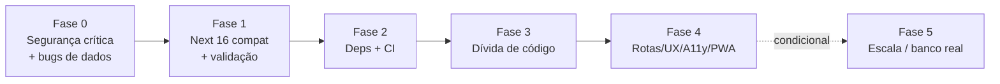

# Plano de Melhoria, Migração e Upgrade — Librosistemo

> Roadmap priorizado, derivado de [`CURRENT_STATE.md`](./CURRENT_STATE.md) (IDs S# = segurança, B# = bug referenciam as tabelas de lá).
> Regras: cada fase entra por uma spec em [`specs/`](./specs/README.md); cada task deixa `yarn test:build` verde; decisões novas geram ADR. Marque itens concluídos com data + commit/PR.
> Agentes responsáveis por área em `.claude/agents/`.

## Fase 0 — Estancar o sangramento (segurança crítica + bugs de corrupção de dados)

**Spec**: [001-hardening-seguranca](./specs/001-hardening-seguranca/spec.md) (aprovada) + hotfixes de bug.
**Agentes**: `security-specialist`, `data-layer-specialist`. **Esforço estimado: 2–4 dias.**

- [ ] **S1** Validar `sheet` contra o enum e nunca expor a aba `auth` (`GET ?sheet=auth` → 400). *Hotfix imediato, independente do resto.*
- [ ] **S2** Sessão real: cookie httpOnly assinado com expiração emitido pelo servidor; middleware valida assinatura; logout de verdade.
- [ ] **S3** Renomear env vars removendo `NEXT_PUBLIC_` (código, `env.template`, READMEs, testes).
- [ ] **S4** Hash de senha (bcrypt/scrypt), HTTP 401 real, `type="password"`, remover logs de auth.
- [ ] **B9** `/api/spreadsheet`: instanciar acesso por handler (fim da variável de módulo), `await` nas escritas, status HTTP corretos.
- [ ] **B2** Corrigir links de edição (usar `id` UUID na URL em vez de índice do slice) — hoje edita o registro errado a partir da página 2.
- [ ] **B3** Corrigir filtro invertido na exclusão de empréstimo.
- [ ] **B6** Só marcar livro `available` quando não restarem empréstimos ativos dele.
- [ ] Testes comportamentais reais para as rotas de API (substituir os testes de "arquivo-como-string") — pré-requisito para confiar nas correções.

## Fase 1 — Compatibilidade Next 16 e correções funcionais restantes

**Agentes**: `migration-specialist`, `frontend-specialist`. **Esforço: 2–3 dias.**

- [ ] **B1** `params` como `Promise` + `React.use(params)` nas 3 rotas dinâmicas restantes.
- [ ] Remover os `'use server'` indevidos dos services (não são Server Actions).
- [ ] **B4** Busca com comparação por `includes` (não regex) + debounce.
- [ ] **B5** Cadastro por lista aceita ISBN único sem `\n`.
- [ ] **B7/B8/B10** Vazamentos de listener, `useEffect([props])`, blob URL sem revoke.
- [ ] **B11** Tratamento de erro honesto: remover coerções `as AxiosResponse` de `undefined`; erro do Sheets vira erro na UI (toast), não lista vazia; adicionar `error.tsx` global.
- [ ] Validação de entrada: schema por entidade (Zod — registrar ADR) nas rotas e nos formulários; `onSubmit` real nos forms; validar ISBN.

## Fase 2 — Higiene de dependências e CI/CD

**Agentes**: `migration-specialist`, `testing-specialist`. **Esforço: 1–2 dias.**

- [ ] Declarar `clsx`; subir `tailwind-merge` para v3 (compatível com Tailwind 4); remover `@types/uuid`; `@types/node` → 24; afrouxar `engines` para `>=24` + criar `.nvmrc`.
- [ ] GitHub Actions: `yarn install --frozen-lockfile && yarn lint --max-warnings 0 && tsc --noEmit && yarn testc && yarn build` em Node 24; adicionar script `typecheck`.
- [ ] Habilitar `coverageThreshold` no Jest (começar nos números atuais e subir por fase); projeto Jest `node` para rotas de API.
- [ ] Dependabot/Renovate; template de PR; LICENSE.
- [ ] Avaliar substituto mantido para `html5-qrcode` (ex.: `barcode-detector`/ZXing) — registrar ADR.
- [ ] Documentar `BASE_URL` no `env.template`.

## Fase 3 — Dívida de código (consolidação)

**Agentes**: `frontend-specialist`, `testing-specialist`. **Esforço: 1–2 semanas, incremental.**

- [ ] Unificar as **4 cópias do formulário de livro** num `BookForm` único (modo create/edit + callbacks); idem para o formulário de usuário (remover `UserCreateForm` morto ou passar a usá-lo).
- [ ] Genérico `PaginatedItems<T>` substituindo o trio `Paginated*Items`.
- [ ] Fábrica de CRUD em `api.ts` (um bloco genérico por entidade) preservando a superfície `api.sheet.*`.
- [ ] Quebrar `useEntities` (ou adotar TanStack Query — ADR) — fim dos 24 retornos.
- [ ] Remover código morto (`services.google`, `validateIsbnFromGoogleApiItems`, `isEmpty`, `calcImageSize`, `getRowById`) e assets de template em `public/`; corrigir README (Google API não é usada).
- [ ] Convergência de estilo (ADR 0004): migrar login e `styles.ts` para Tailwind; eliminar CSS duplicado da paginação; cores no `@theme`; avaliar remoção de `react-select` (Emotion).
- [ ] Corrigir typos de identificadores e de UI; reduzir os 44 `as unknown as` com parsing tipado na borda (Zod da fase 1); resolver as 7 supressões de `exhaustive-deps`.
- [ ] Substituir testes vacuosos de `login.test.tsx` por asserções reais.

## Fase 4 — Rotas, UX, acessibilidade e PWA

**Agentes**: `frontend-specialist`, `docs-specialist`. **Esforço: ~1 semana.**

- [ ] **Migração de rotas**: eliminar o prefixo `/pages` (mover para `src/app/dashboard/...` com route group) e normalizar edição de livro para `/dashboard/books/[id]`; redirects no `next.config.ts`; atualizar `proxy.ts` e constantes de rota centralizadas.
- [ ] Decidir (ADR) se o acervo (`/`) volta a ser público — hoje tudo exige login.
- [ ] Acessibilidade: `lang="pt-BR"`, `aria-*` e teclado nos 12 `
`, foco visível, labels nos formulários, `<main>`/headings, `next/image` ou `` com lazy/fallback.
- [ ] PWA de verdade: `manifest.webmanifest` via App Router, ícones corrigidos, `viewport`/`themeColor`, service worker básico — app instalável (é mobile-first).
- [ ] Estados de loading com `loading.tsx`/Suspense; empty states revisados.
- [ ] i18n: no mínimo extrair strings para dicionário central (decisão de lib completa via ADR).

## Fase 5 — Escala e futuro da fonte de dados

**Agentes**: `migration-specialist`, `data-layer-specialist`. **Condicionada a crescimento de uso — decidir via ADR antes de executar.**

- [ ] Cache server-side do Sheets (revalidate/`unstable_cache` + invalidação nas escritas) — elimina recarga total por request; corrige também o custo do login.
- [ ] Batch real no cadastro em lote (uma leitura, N `addRows`).
- [ ] Capas fora da planilha (filesystem/object storage/Drive) — hoje base64 na célula.
- [ ] **Migração Sheets → banco real** (SQLite/Turso/Postgres): extrair interface de repositório preservando `api.sheet.*`, implementar novo backend, script de migração de dados, dupla-escrita temporária, corte. Substitui o ADR 0002.
- [ ] Campo de devolução em `Lend` (hoje devolver = excluir linha, sem histórico) — mudança de modelo + template da planilha.

## Sequência recomendada

A fase 0 não espera nada: o item S1 (`?sheet=auth`) é um hotfix de uma linha de validação e deve ser o primeiro commit após este plano.
