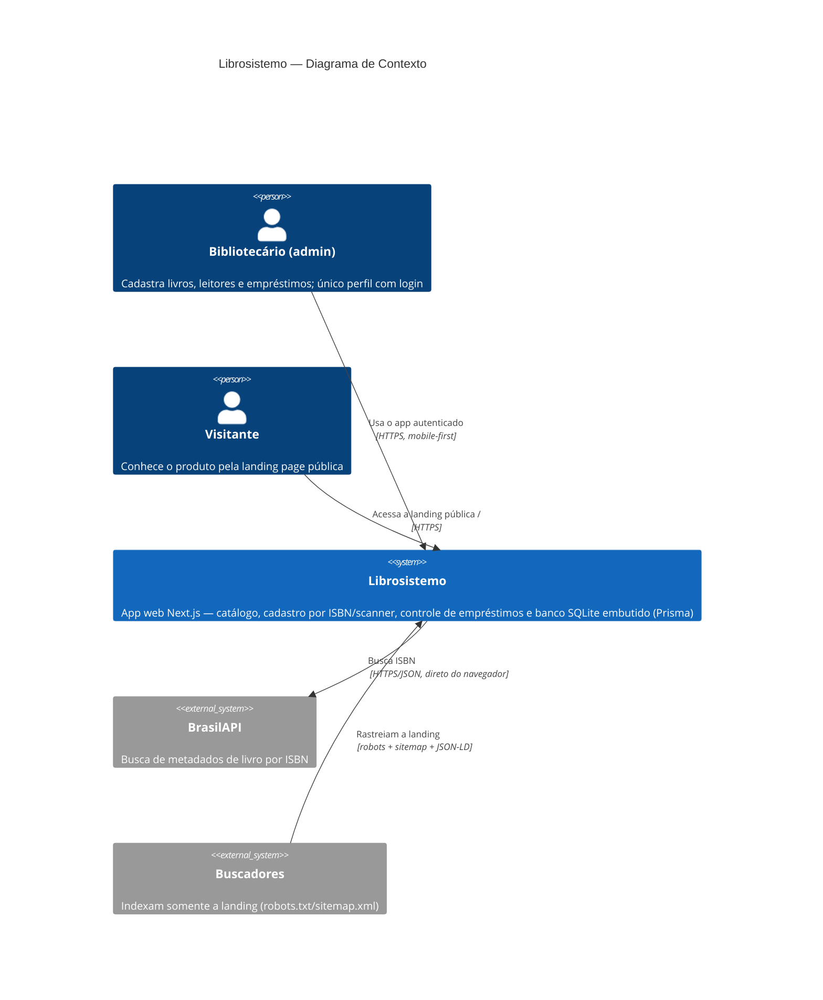

# C4 — Nível 1: Contexto de Sistema

O Librosistemo é um sistema open source de gestão de biblioteca pequena (acervo, leitores e empréstimos), operado por um único administrador (bibliotecário) principalmente pelo celular. Desde 2026-08-16 existe uma landing page pública que apresenta o produto a visitantes.

## Observações

- Não há outros perfis nem multiusuário; "usuários" cadastrados no sistema são **leitores** (registros), não contas de acesso. A conta de acesso é o modelo `Admin` (seed a partir de `ADMIN_USERNAME`/`ADMIN_PASSWORD`).
- **O banco de dados deixou de ser um sistema externo**: o Google Sheets (ADR 0002, obsoleto) foi substituído por **SQLite via Prisma** (ADR 0007) — um arquivo local dentro do deploy, sem credenciais de terceiros. A planilha antiga só é tocada pelo script one-shot `yarn db:import-sheets`.
- **A landing `/` é pública** (`src/proxy.ts` a libera explicitamente); todo o resto — `/pages/dashboard/...` — exige cookie de sessão assinado válido. `robots.txt` e `sitemap.xml` garantem que só a landing seja indexável.
- A BrasilAPI é consultada a partir do navegador (client-side, via axios). A antiga integração morta com a Google Books API foi removida de `src/services/api.ts`.
- Deploy exige filesystem persistente para o arquivo SQLite (restrição documentada no ADR 0007); o `compose.yaml` resolve isso com volume nomeado.
