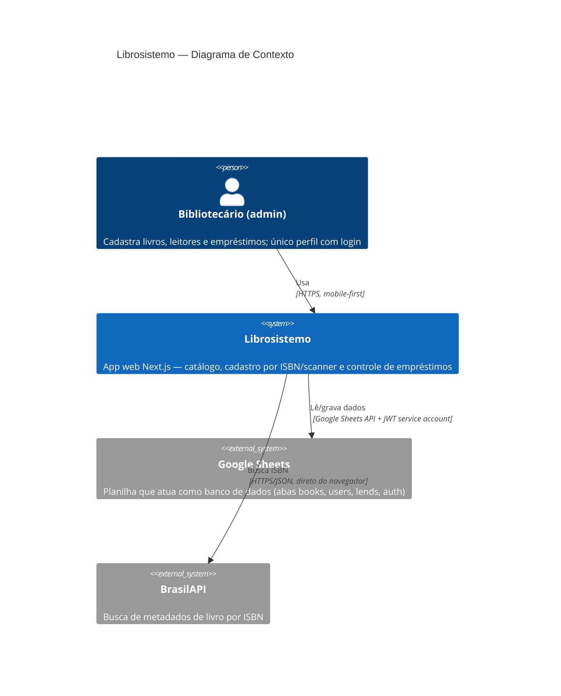

# C4 — Nível 1: Contexto de Sistema

O Librosistemo é um sistema de gestão de biblioteca pequena (acervo, leitores e empréstimos), operado por um único administrador (bibliotecário) principalmente pelo celular.

## Observações

- Não há outros perfis nem multiusuário; "usuários" cadastrados no sistema são **leitores** (registros), não contas de acesso.
- **Não existe área pública**: o middleware (`src/proxy.ts`) protege inclusive a home `/` — toda navegação exige o cookie de login.
- A BrasilAPI é consultada a partir do navegador (client-side, via axios). Existe integração com a Google Books API em `src/services/api.ts:20-24`, mas ela **nunca é chamada** (código morto — o README a anuncia indevidamente).
- A planilha é também a interface de administração "crua" dos dados: o bibliotecário pode editá-la diretamente no Google Sheets.
