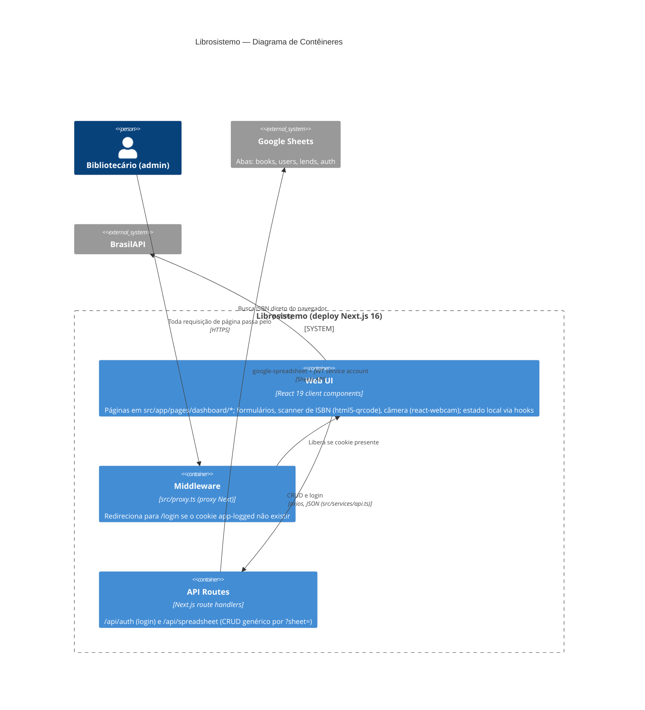

# C4 — Nível 2: Contêineres

Um único deploy Next.js concentra três responsabilidades executáveis: a UI (client components no navegador), as API routes (server) e o middleware de acesso.

## Decisões e restrições por contêiner

| Contêiner | Tecnologia | Pontos relevantes |
|---|---|---|
| Web UI | React 19, styled-components + Tailwind 4 (ADR 0004) | Todas as páginas são client components; dados buscados no mount via `useEntities` |
| Middleware | `src/proxy.ts` | Protege tudo exceto `api/auth`, `login` e assets; **valida só a presença do cookie** (vulnerabilidade — spec 001) |
| API Routes | `src/app/api/*` | Única camada que toca as credenciais Google; CRUD genérico sem validação de payload (spec 001) |
| "Banco" | Google Sheets (ADR 0002) | Sem transações/integridade referencial; leitura completa por request |

## Fluxo típico (cadastro de livro por ISBN)

1. Admin escaneia/digita ISBN → UI consulta a BrasilAPI direto do navegador (`services.brasilapi` em `src/services/api.ts`).
2. UI checa duplicidade (`src/lib/checkIfBookAlreadyExists.ts`).
3. UI faz `POST /api/spreadsheet?sheet=books` → route handler grava linha na aba `books` com `id` UUID.

> A integração com Google Books (`services.google`) e o validador `src/lib/validateIsbnFromGoogleApiItems.ts` existem no código mas não são usados por nenhuma página (código morto).
