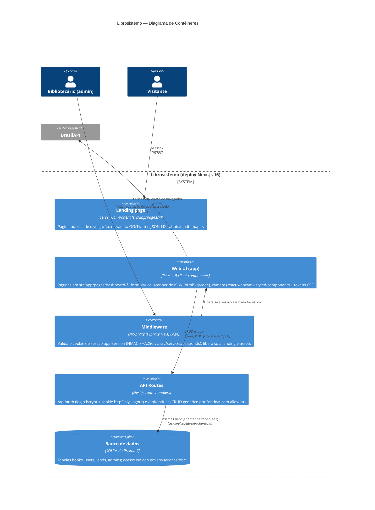

# C4 — Nível 2: Contêineres

Um único deploy Next.js concentra as responsabilidades executáveis: a UI (client components no navegador), a landing pública (Server Component), as API routes, o middleware de sessão e o banco SQLite embutido. Em Docker, o app roda em um container com o banco em volume nomeado (`compose.yaml`).

## Decisões e restrições por contêiner

| Contêiner | Tecnologia | Pontos relevantes |
|---|---|---|
| Landing page | Server Component + Metadata API | Única superfície pública e indexável (robots/sitemap); identidade do produto em `src/config/info.ts`, URL pública em `SITE_URL` |
| Web UI (app) | React 19, styled-components 6 (ADR 0008) | Todas as páginas do dashboard são client components; dados buscados no mount via `useEntities`; URLs com prefixo `/pages` (dívida — Fase 4) |
| Middleware | `src/proxy.ts` | Valida assinatura HMAC e expiração do cookie — não só presença (fecha S2); matcher exclui `api/auth`, `login`, assets, `robots.txt`, `sitemap.xml` |
| API Routes | `src/app/api/*` | `/api/entities` com allowlist (400 fora dela), sem estado de módulo, status HTTP reais; `/api/auth` com bcrypt e 401 real; sem validação de schema de payload ainda (Zod — Fase 1) |
| Banco | SQLite via Prisma (ADR 0007) | Transacional, `id` UUID como chave primária; arquivo fora do git; exige filesystem persistente (em Docker: volume nomeado) |

## Fluxo típico (cadastro de livro por ISBN)

1. Admin escaneia/digita ISBN → UI consulta a BrasilAPI direto do navegador (`services.brasilapi` em `src/services/api.ts`).
2. UI checa duplicidade (`src/lib/checkIfBookAlreadyExists.ts`).
3. UI faz `POST /api/entities?entity=books` → route handler valida a entidade, coage os tipos na borda (`repositories.ts`) e grava via Prisma, respondendo **201**.

## Operação e qualidade

- **CI** (`.github/workflows/ci.yml`): job `quality` (`yarn ci` = lint + typecheck + testes com cobertura + build) e job `e2e` (build + Playwright chromium) em push/PR para `main` (ADR 0009).
- **E2E**: Playwright (`e2e/`) sobe um build de produção com banco descartável `e2e.db` e cobre o fluxo de autenticação em perfis mobile e desktop.
- **Docker**: `docker compose up --build` (prod) ou `--profile dev` (hot reload); `yarn db:setup` roda na subida do container (migrate + seed do admin).
