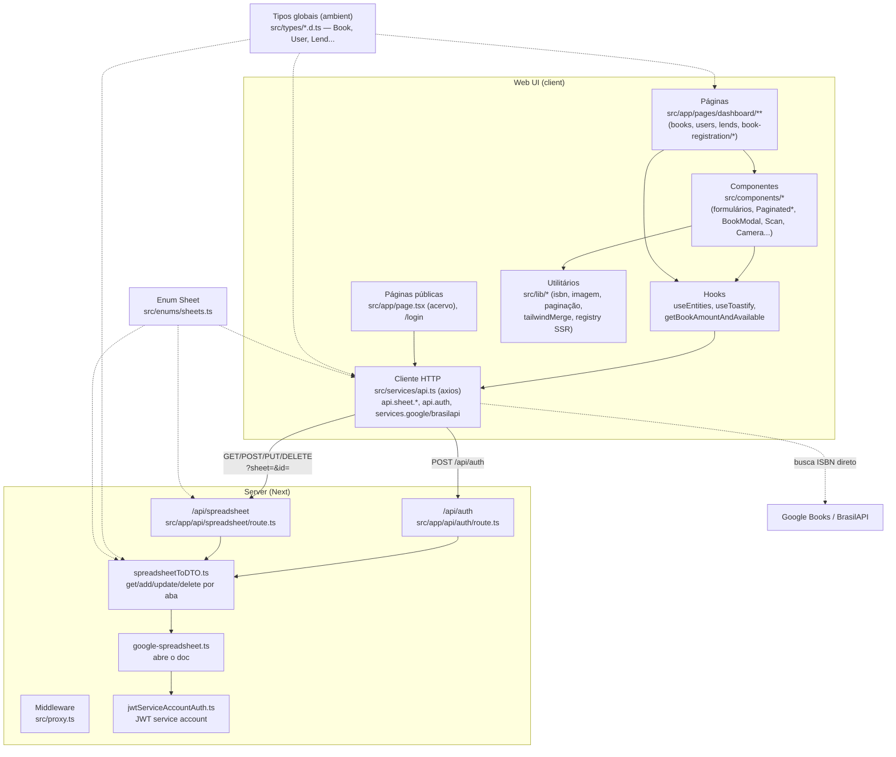

# C4 — Nível 3: Componentes (dentro do deploy Next.js)

## Responsabilidades

| Componente | Responsabilidade | Observações |
|---|---|---|
| Páginas dashboard | Fluxos admin: listar/criar/editar books, users, lends; 4 modos de cadastro de livro (manual, digitação de ISBN, lista, scanner) | Todas `'use client'`; URLs com prefixo `/pages` (dívida — ADR 0001) |
| `useEntities` | Busca e mantém estado de books/users/lends + filtros/options | Retorna 24 valores; sempre busca no mount; candidato a refactor |
| `src/services/api.ts` | Superfície client de CRUD por entidade + integrações ISBN | CRUD triplicado por entidade (duplicação conhecida) |
| `/api/spreadsheet` | CRUD genérico por query `?sheet=` | Bug de variável de módulo (spec 001, CA6); sem validação |
| `/api/auth` | Login contra aba `auth` | Texto puro, HTTP 200 em falha (spec 001) |
| `spreadsheetToDTO.ts` | Traduz abas ↔ DTOs; resolve `id` (UUID) → `rowNumber` | Lê a planilha inteira por operação; fallback silencioso em erro |
| `jwtServiceAccountAuth.ts` | Credenciais + JWT Google | Usa env vars `NEXT_PUBLIC_*` (spec 001, CA1) |
| Tipos ambient | `Book`, `User`, `Lend`, `Option`, DTOs de APIs externas | Sem import/export — adicionar um `import` quebra o escopo global |

## Componentes de UI notáveis

- **Formulários**: `BookCreateForm`, `BookCreateFormFromList` (quase duplicados), `BookEditForm`, `UserCreateForm`, `UserEditForm`.
- **Listagem/paginação**: `PaginatedBooks`, `PaginatedBookItems`, `PaginatedUserItems`, `PaginatedLendsItems` (trio quase idêntico), `AllBooks`, `Gallery`.
- **Hardware**: `Scan` (html5-qrcode, leitura de código de barras), `Camera`/`SelectPhoto` (react-webcam, foto de capa) — sempre mockados em teste.
- **Suporte**: `Loading`, `Empty`, `BookModal`, `DeleteModal`, `LayoutMenu`, `BackToTopButton`.
