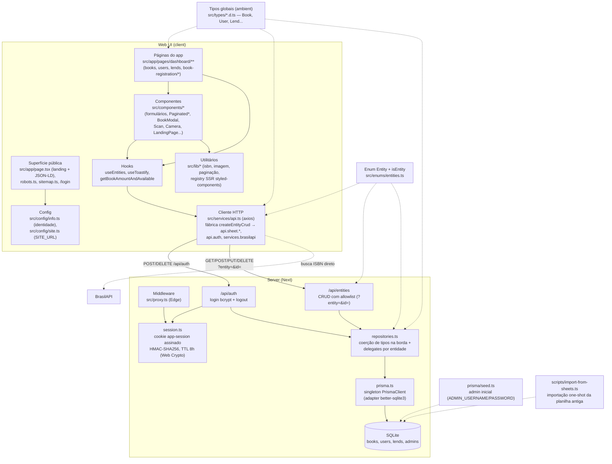

# C4 — Nível 3: Componentes (dentro do deploy Next.js)

## Responsabilidades

| Componente | Responsabilidade | Observações |
|---|---|---|
| Landing (`page.tsx` + `LandingPage.tsx`) | Divulgação pública: hero, features, passos de instalação, links para GitHub/manual | Server Component com metadata OG/Twitter e JSON-LD `SoftwareApplication`; única rota indexável |
| Páginas dashboard | Fluxos admin: listar/criar/editar books, users, lends; 4 modos de cadastro de livro (manual, digitação de ISBN, lista, scanner) | Todas `'use client'`; URLs com prefixo `/pages` (dívida — Fase 4) |
| `useEntities` | Busca e mantém estado de books/users/lends + filtros/options | Ainda retorna 24 valores; sempre busca no mount; candidato a refactor (Fase 3) |
| `src/services/api.ts` | Superfície client de CRUD (`api.sheet.*` via fábrica `createEntityCrud`), auth e BrasilAPI | Contrato preservado na migração; erros ainda viram `undefined` coagido (B11) |
| `/api/entities` | CRUD genérico por `?entity=` | Allowlist (400 fora dela), 404 via `P2025`, 201 no create; sem validação de schema de payload (Zod — Fase 1) |
| `/api/auth` | Login bcrypt contra tabela `admins`; logout | 401 real em falha; cookie httpOnly/`sameSite: lax`/`secure` em produção |
| `session.ts` | Criar/verificar token assinado (HMAC-SHA256, Web Crypto) | Compartilhado entre rota Node e proxy Edge; fallback de segredo em dev |
| `repositories.ts` | Coerção de tipos por entidade na borda + acesso Prisma | Fronteira entre JSON solto dos formulários e o schema tipado |
| `prisma.ts` | Singleton do PrismaClient (adapter better-sqlite3) | Client gerado em `src/generated/prisma` — nunca importar fora de `src/services/db/` |
| `prisma/seed.ts` / `scripts/import-from-sheets.ts` | Admin inicial / migração one-shot da planilha | Importador é somente-leitura na planilha; `google-spreadsheet` é devDependency |
| Tipos ambient | `Book`, `User`, `Lend`, `Option`, DTOs de APIs externas | Sem import/export — adicionar um `import` quebra o escopo global |

## Componentes de UI notáveis

- **Formulários**: `BookCreateForm`, `BookCreateFormFromList` (quase duplicados — Fase 3), `BookEditForm`, `UserEditForm` (`UserCreateForm` segue morto); estilos compartilhados em `formStyles.ts`.
- **Listagem/paginação**: `PaginatedBooks`, `PaginatedBookItems`, `PaginatedUserItems`, `PaginatedLendsItems` (trio quase idêntico — Fase 3), `AllBooks`, `Gallery`.
- **Hardware**: `Scan` (html5-qrcode, leitura de código de barras), `Camera`/`SelectPhoto` (react-webcam, foto de capa) — sempre mockados em teste.
- **Suporte**: `Loading`, `Empty`, `BookModal`, `DeleteModal`, `LayoutMenu`/`LayoutChrome`, `BackToTopButton`.
- **Estilo**: styled-components único (ADR 0008) com tokens CSS em `src/app/globals.css` (`var(--color-primary)` etc.).
